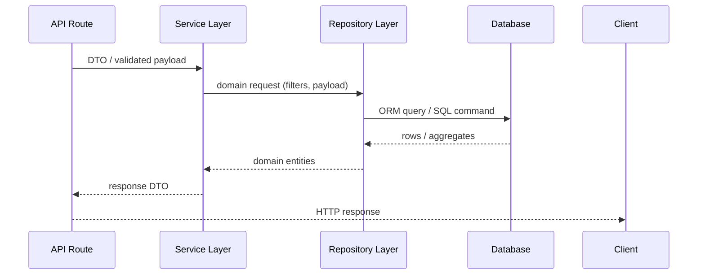

# Layered Backend Architecture Guide

Structure backend features around clear layers — **database → repository → service → API routes** — to keep domain logic maintainable, testable, and scalable.

---

## 🧱 Core Layers & Responsibilities

1. **Database Layer**  
   - Schema definitions, migrations, seed data  
   - Raw queries (SQL/ORM) with zero business logic  
   - One source of truth for constraints and relationships

2. **Repository Layer**  
   - Thin wrapper around database client (Prisma, Drizzle, Knex, etc.)  
   - Maps raw rows ↔ domain entities  
   - Handles query composition, pagination, sorting, projections  
   - No cross-entity business rules

3. **Service Layer**  
   - Orchestrates repositories, caches, queues, external APIs  
   - Implements validation, invariants, workflows, transactions  
   - Returns domain objects suitable for API delivery

4. **API Routes**  
   - HTTP/edge handlers (Next.js, Express, Fastify…)  
   - Deserialize/validate input, call services, shape responses  
   - No business logic beyond request/response management

---

## 🗂️ Recommended File Structure

```
src/
├── database/
│   ├── client.ts              # ORM/driver initialization
│   ├── migrations/            # Schema migrations
│   └── seed/                  # Seed scripts + fixtures
│
├── repositories/
│   ├── base/                  # Generic repository helpers
│   ├── user.repository.ts     # User-specific data access
│   ├── donation.repository.ts # Feature repositories
│   └── index.ts               # Export map
│
├── services/
│   ├── user.service.ts        # Pure business logic
│   ├── donation.service.ts
│   └── index.ts
│
├── api/
│   ├── users/
│   │   ├── route.ts           # HTTP handler (Next.js style)
│   │   └── validators.ts      # zod/yup schemas
│   └── donations/
│       └── route.ts
│
├── tests/
│   ├── repositories/
│   ├── services/
│   └── api/
└── shared/
    ├── types/
    ├── errors/
    └── utils/
```

---

## 🔄 Data Flow (High-Level)



---

## 🚀 Quick Start Checklist

1. **Define Schema** in `src/database/migrations`  
2. **Expose Database Client** via `src/database/client.ts`  
3. **Create Repository** per entity with CRUD + contextual queries  
4. **Add Service** to orchestrate workflows and enforce rules  
5. **Wire API Route** that validates input and invokes the service  
6. **Write Tests**: unit for services, integration for repositories, contract/e2e for API  
7. **Document Contracts** (OpenAPI / README / storybook-equivalent)

---

## 🧬 Database Layer Essentials

### Client Setup (`src/database/client.ts`)

```ts
import { PrismaClient } from '@prisma/client';

declare global {
  // Prevent hot-reload duplicates
  // eslint-disable-next-line no-var
  var prisma: PrismaClient | undefined;
}

export const dbClient = globalThis.prisma ?? new PrismaClient();

if (process.env.NODE_ENV !== 'production') {
  globalThis.prisma = dbClient;
}
```

### Migration Notes
- Prefer **idempotent** migrations (no destructive `DROP` without backup plan).
- Co-locate raw SQL and ORM schema for clarity.
- Seed data should live under `src/database/seed` and reference repositories only for convenience scripts, never services.

---

## 🗄️ Repository Layer Patterns

### Base Types

```ts
export interface RepositoryContext {
  db: PrismaClient;
}

export interface PaginatedResult<TEntity> {
  data: TEntity[];
  total: number;
  page: number;
  pageSize: number;
}
```

### Example Repository (`src/repositories/user.repository.ts`)

```ts
import { dbClient } from '@/src/database/client';
import { RepositoryContext } from './base/types';

export interface UserRecord {
  id: string;
  email: string;
  displayName: string;
  status: 'active' | 'suspended';
  createdAt: Date;
}

const ctx: RepositoryContext = { db: dbClient };

export const userRepository = {
  async findById(id: string): Promise<UserRecord | null> {
    return ctx.db.user.findUnique({ where: { id } });
  },

  async findByEmail(email: string): Promise<UserRecord | null> {
    return ctx.db.user.findUnique({ where: { email } });
  },

  async list(page: number, pageSize: number): Promise<PaginatedResult<UserRecord>> {
    const [data, total] = await Promise.all([
      ctx.db.user.findMany({
        skip: (page - 1) * pageSize,
        take: pageSize,
        orderBy: { createdAt: 'desc' },
      }),
      ctx.db.user.count(),
    ]);

    return { data, total, page, pageSize };
  },

  async create(payload: Pick<UserRecord, 'email' | 'displayName'>): Promise<UserRecord> {
    return ctx.db.user.create({
      data: { ...payload, status: 'active' },
    });
  },
};
```

#### Repository Guidelines
- Keep repositories **stateless**; inject context when needed.
- **Never** import services into repositories (only downward dependencies).
- Return **domain-safe shapes**; map to DTOs in services or API layer.

---

## ⚙️ Service Layer Patterns

### Example Service (`src/services/user.service.ts`)

```ts
import { userRepository } from '@/src/repositories/user.repository';
import { DomainError } from '@/src/shared/errors/domain-error';

export interface CreateUserInput {
  email: string;
  displayName: string;
}

export const userService = {
  async createUser(input: CreateUserInput) {
    const existing = await userRepository.findByEmail(input.email);

    if (existing) {
      throw new DomainError('EMAIL_TAKEN', 'Email is already registered');
    }

    const user = await userRepository.create(input);

    // Domain events / notifications can be emitted here
    return user;
  },

  async suspendUser(id: string) {
    const user = await userRepository.findById(id);

    if (!user) {
      throw new DomainError('USER_NOT_FOUND', 'User does not exist');
    }

    if (user.status === 'suspended') {
      return user;
    }

    return userRepository.updateStatus(id, 'suspended');
  },
};
```

#### Service Guidelines
- Services own **business invariants** and cross-entity workflows.
- Compose multiple repositories, cache layers, queues, or external APIs.
- Keep services **framework-agnostic** (no `Request`/`Response` imports).
- Prefer **explicit inputs/outputs**; avoid leaking persistence shapes.

---

## 🌐 API Routes

### Example Next.js Route (`src/api/users/route.ts`)

```ts
import { NextRequest, NextResponse } from 'next/server';
import { z } from 'zod';
import { userService } from '@/src/services/user.service';

const createUserSchema = z.object({
  email: z.string().email(),
  displayName: z.string().min(2),
});

export async function POST(req: NextRequest) {
  const body = await req.json();
  const parsed = createUserSchema.safeParse(body);

  if (!parsed.success) {
    return NextResponse.json(
      { error: 'VALIDATION_ERROR', details: parsed.error.flatten() },
      { status: 422 },
    );
  }

  try {
    const user = await userService.createUser(parsed.data);
    return NextResponse.json(user, { status: 201 });
  } catch (error) {
    if (error instanceof DomainError) {
      return NextResponse.json({ error: error.code, message: error.message }, { status: 400 });
    }
    throw error;
  }
}
```

#### API Guidelines
- Validate **everything** at the boundary (zod, yup, superstruct).  
- Convert domain errors to meaningful HTTP responses.  
- Never import repositories directly — always go through services.  
- Keep routes thin; complex response shaping belongs in presenter/helper utilities.

---

## 🧪 Testing Strategy

- **Database:** migration smoke tests + seed verification.  
- **Repository:** integration tests against real DB (or Dockerized test DB).  
- **Service:** unit tests with repository mocks + invariant coverage.  
- **API:** contract tests (Supertest/Next API testing), schema snapshot, error handling.  
- **End-to-End:** optional, but helpful for critical flows involving all layers.

Example service test snippet:

```ts
import { describe, expect, it, vi } from 'vitest';
import { userService } from '@/src/services/user.service';
import { userRepository } from '@/src/repositories/user.repository';

vi.mock('@/src/repositories/user.repository');

describe('userService.createUser', () => {
  it('throws when email exists', async () => {
    vi.mocked(userRepository.findByEmail).mockResolvedValue({
      id: 'user_1',
      email: 'taken@example.com',
      displayName: 'Example',
      status: 'active',
      createdAt: new Date(),
    });

    await expect(
      userService.createUser({ email: 'taken@example.com', displayName: 'New User' }),
    ).rejects.toMatchObject({ code: 'EMAIL_TAKEN' });
  });
});
```

---

## ✅ Best Practices

1. **Single Responsibility per Layer** — Each class/module should only touch the adjacent layer.  
2. **Explicit Transactions** — Wrap multi-step DB operations via services, not repositories.  
3. **Type Safety Across Boundaries** — Share DTO/domain types via `src/shared/types`.  
4. **Error Normalization** — Centralize domain + infrastructure errors for predictable responses.  
5. **Dependency Injection Ready** — Pass repositories into services for easier testing.  
6. **Avoid Circular Imports** — Uphold directional graph: API → Services → Repositories → Database.  
7. **Documentation-First** — Keep this guide aligned with actual folder structure.

---

## 🔧 Common Patterns

- **Bulk Operations:** Services chunk payloads, repositories execute efficient bulk queries.  
- **Caching:** Services decide when to read/write cache; repositories stay DB-only.  
- **Background Jobs:** Services publish events/queue messages after DB commits.  
- **Audit Logging:** Database triggers or repository hooks append audit records.  
- **Feature Toggles:** Services check toggles before invoking repositories.

---

## 📈 Migration Checklist

- [ ] Move raw queries into repositories under `src/repositories`.  
- [ ] Ensure services only consume repositories + shared utilities.  
- [ ] Refactor API routes to call services exclusively.  
- [ ] Replace direct DB usage in routes with repository/service calls.  
- [ ] Add validation schemas for every route.  
- [ ] Backfill tests for repositories/services before deleting legacy code.  
- [ ] Update docs and diagrams after restructuring.  
- [ ] Run full regression tests (unit + integration + API).  
- [ ] Monitor metrics/logs post-deploy for unexpected query patterns.

---

## 📚 Reference Table

| Concern | Layer | Example |
|--------|-------|---------|
| Input validation | API route | `createUserSchema` |
| Duplicate email check | Service | `userService.createUser` |
| Pagination query | Repository | `userRepository.list` |
| Foreign key constraint | Database | `ALTER TABLE ... REFERENCES` |
| Transaction boundary | Service | `dbClient.$transaction([...])` |
| Response shaping | API route | `NextResponse.json` |

---

## 🚧 Anti-Patterns to Avoid

- Repositories importing services (creates circular logic).  
- API routes writing SQL directly.  
- Services passing `Request`/`Response` objects around.  
- Silent error swallowing — always bubble up or map to consistent error objects.  
- Business logic inside ORM hooks (`beforeCreate` etc.) without tests.  
- Using `any` types in TypeScript layers (breaks contracts and violates project rules).

---

## 🔮 Future Enhancements

- Generate repository + service scaffolds via CLI templates.  
- Adopt OpenAPI + typed clients per route.  
- Introduce CQRS flavor (read/write repositories) for high-scale domains.  
- Add caching strategy guide (Redis, in-memory, CDN).  
- Document async workflows (sagas, outbox pattern).  
- Provide observability cookbook (logs, metrics, tracing per layer).

---

## 💡 Tips

1. Start with the **domain language**; schemas and services should mirror real terms.  
2. Keep **DTOs immutable** — prefer readonly outputs, cloning when necessary.  
3. Make **repositories composable** (filters, scopes) instead of copy-paste queries.  
4. Use **feature toggles** inside services to flip behaviors safely.  
5. Log **layer boundaries** for easier debugging (request id + user id).  
6. Re-run **integration tests** whenever migrations or repository signatures change.  
7. Keep this document updated — it is the onboarding path for every backend engineer.

---

**Remember:** Treat each layer as a contract. When in doubt, push logic **down** (closer to the data) for integrity or **up** (closer to the API) for presentation—never sideways. 🎯

